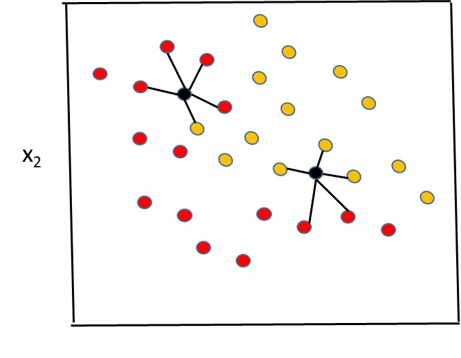

# K Nearest Neighbor (kNN)

k最临近算法是一种基本的分类和回归方法, 它通过计算输入样本与训练集中所有样本的距离, 选择距离最近的k个样本中出现最多的类别作为预测结果.

## 优点

- 简单, 容易理解
- 适用于多分类问题
- 适用于非线性数据

## 缺点

- 需要保存全部训练数据, 计算复杂度高
- 预测时需要计算输入样本与所有训练集样本的距离, 计算复杂度高
- 需要选择合适的k值, k值过小容易受到噪声影响, k值过大容易受到样本不平衡问题影响

## 应用场景

- 小样本数据集
- 非线性数据
- 多分类问题

## 算法步骤

1. 计算输入样本与所有训练集样本的距离
2. 选择距离最近的k个样本
3. 对k个样本中出现最多的类别作为预测结果

## 距离度量

kNN 算法的一个重要问题是如何计算样本之间的距离. 常用的距离度量包括:

- 欧氏距离 (Euclidean distance)
- 曼哈顿距离 (Manhattan distance)
- 闵可夫斯基距离 (Minkowski distance)
- 切比雪夫距离 (Chebyshev distance)
- 余弦相似度 (Cosine similarity)

## 实例

- 推荐系统：通过计算用户或物品之间的相似度，找到最相似的k个用户或物品，然后根据这k个用户的行为或这k个物品的属性来进行推荐。

- 手写数字识别：通过计算待识别的数字图像与训练集中所有数字图像的距离，选择距离最近的k个数字图像，然后选择这k个数字图像中出现最多的数字作为预测结果。

- 图像识别：通过计算待识别的图像与训练集中所有图像的距离，选择距离最近的k个图像，然后选择这k个图像中出现最多的类别作为预测结果。

- 文本分类：通过计算待分类的文本与训练集中所有文本的距离，选择距离最近的k个文本，然后选择这k个文本中出现最多的类别作为预测结果。

- 异常检测：通过计算待检测的数据点与训练集中所有数据点的距离，如果待检测的数据点与最近的k个数据点的距离大于某个阈值，那么就认为这个数据点是异常的。