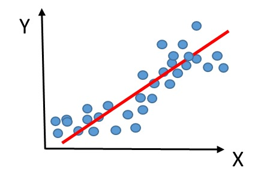

# linear regression

线性回归是一种预测模型, 它试图建立一个线性关系

目标为找到一组参数a和b，使得模型对训练数据的预测值与实际值之间的差距（通常用平方误差来衡量）最小。

## 缺点

非线性分布无法预测

## 表达

y = a1x1 + a2x2 + ... + an*xn + b

> 其中，y是因变量，x1到xn是自变量，a1到an是模型的参数，表示每个自变量对因变量的影响程度，b是截距项。

## sum square residual loss function 平方残差和

用于衡量模型预测值与实际值之间的差距

## 实例

- 排队 9个人排成一队, 但不是很整齐, 但整体趋势是一条直线, 线性回归可以预测下1个人的位置 y=ax+b
- 身高体重 已知9个人的身高体重, 已知下1个人的身高, 线性回归可以预测其体重
