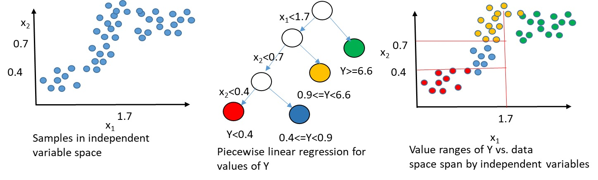

# regression trees 回归树

回归树是一种决策树模型，用于处理连续值的预测问题，也就是回归问题

与分类树（处理离散值的预测问题）不同，回归树的目标是预测一个连续的输出。

## 优点

- 非线性分布可以预测

## 缺点

- 过拟合问题

## 表达

- 用树结构表达非线性关系

## 步骤

1. 通过分割数据集来构建一棵树 (使用的是平方误差最小化或者绝对误差最小化等指标寻找最佳分割点)
2. 重复步骤1, 直到满足停止条件
3. 预测时, 从根节点开始, 选择一个分支, 直到叶子节点, 返回叶子节点的值
4. 预测值为所有叶子节点的值的平均值

## 实例

- 股票价格 已知历史股票价格, 可以预测未来股票价格
- 人口数量 已知历史人口数量, 可以预测未来人口数量