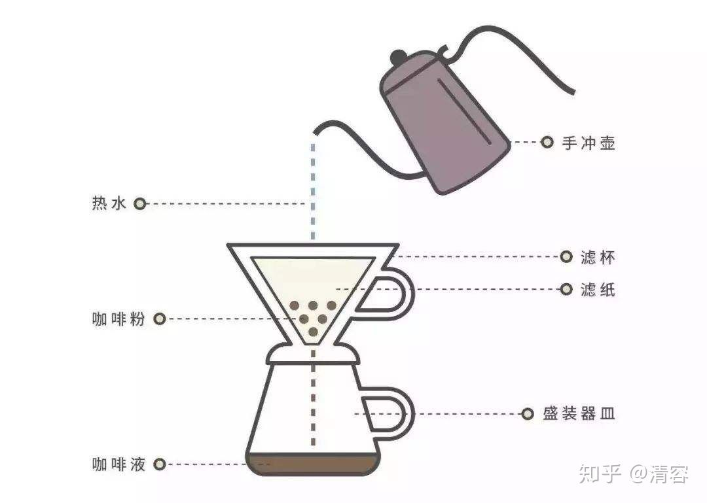
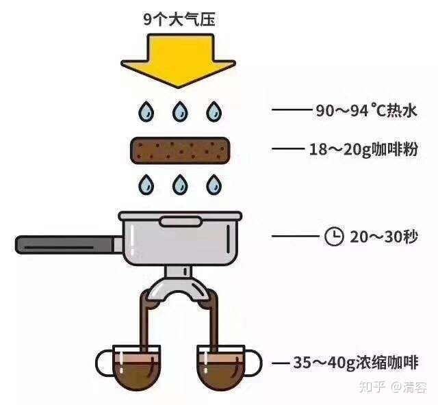

# coffee

## 流程

```bash
产地 ---------> 咖啡生豆 ---------> 咖啡豆(浅/中/深色)
     日晒 水洗            烘焙
```

> `roast烘焙` 类似牛排几分熟, 轻度具有草本的酸味, 重度具有焦糖和油脂的炭烤味道; 品味咖啡一般选轻度, 保留原本味道; 重度烘焙可能意味着原咖啡豆味道不好, 需要掩盖.

> `意式咖啡` 是多种咖啡豆按比例混合, 中深度烘焙, 并添加各种辅料

> `原产地咖啡` 带地名的咖啡, 如 耶加雪啡水洗咖啡, 哥伦比亚慧蓝咖啡

## 咖啡豆

| en              | 质量 | 咖啡因 | 产地                             | 产量 | 调味剂 |
| --------------- | ---- | ------ | -------------------------------- | ---- | ------ |
| 阿拉比卡Arabica | 更优 | x      | 牙买加蓝山,印尼曼特宁,夏威夷科纳 | 70%  | 少     |
| 罗布斯塔Robusta | 次优 | 2x     | 东半球越南,印尼,非洲,海南,广东   | 30%  | 多     |

> `利比利卡 Liberica` 第三种咖啡豆, 产量很少, 不足1%, 几乎不商用

> `避潮` 咖啡豆需要避潮, 不能放冰箱

> `咖啡包装袋小孔` 咖啡豆会产出一些二氧化碳, 为防止这些二氧化碳胀坏袋子而设计的单向气阀 (不是为了选购时挤压闻气味的!~)

## 咖啡

```bash
            |==========|                                         |
浓缩咖啡        浓缩咖啡

            |==========|==========|                              |
玛奇亚朵        浓缩咖啡      奶泡

            |==========|=====================================|   |
美式           浓缩咖啡                    水

            |==========|=====================|                    |
白咖啡         浓缩咖啡             牛奶       

            |==========|=====================|====================|
拿铁           浓缩咖啡             牛奶                 奶泡

            |==========|==========|                               |
康宝蓝         浓缩咖啡     鲜奶油       

            |==========|=====================|================|   |
半拿铁          浓缩咖啡        半牛奶半奶油               奶泡

            |==========|==========|============================|  |
卡布奇诺        浓缩咖啡      牛奶                奶泡

            |==========|==========|===========|================|   |
摩卡           浓缩咖啡    巧克力糖浆     牛奶           鲜奶油

            |==========|=====================|============|        |
焦糖玛奇朵       浓缩咖啡          奶泡+糖浆            焦糖

            |==========|==========|===========|                    |
爱尔兰咖啡       浓缩咖啡     威士忌       鲜奶油

            |==========|==========|===========|                    |
维也纳咖啡       浓缩咖啡   巧克力糖浆    鲜奶油
```

## 咖啡因

    咖啡因是一种中枢神经兴奋剂, 透过刺激交感神经

### 作用

- `提神, 抗疲劳`
- `增强运动表现` 延缓肌肉 / 中枢疲劳 (包括增加耐力的有氧运动 与 增加肌肉的无氧运动)
- `提升基础代谢`

### 生理表现

- 短暂性心跳加速, 血压升高 (长期喝不会有)
- 心情亢奋
- 血压上升
- 促进肠胃蠕动
- 促进胃酸分泌
- 利尿
- 预防勃起功能障碍
- 预防阿茨海默症

> `过量` 神经过敏、易怒、焦虑、震颤、肌肉抽搐、失眠和心悸

### 安全剂量

- 成年人 200~300mg
- 孕妇 100~200mg
- 青少年 100mg
- 小于12岁 0mg

### 原理

```bash
# TIPS: 咖啡在不困的时候喝效果最好

# 腺苷 Adenosine : o
# 咖啡因 Caffeine: x
# 受体: [ ]

# 日常状态: 不困
o  o    o       o
[ ] [ ] [ ] [o] [ ]

# 犯困原因: 腺苷  + 受体
[o] [o] [o] [o] [o]

# 不困原因: 咖啡因代替腺苷, 抢占了受体
o   o o
[x] [x] [x] [x] [x]
            o  o

# 已经很困时, 腺苷已经占据了受体, 再喝咖啡因收效甚微. 
x               x
[o] [o] [o] [o] [o]         (已经很困)
    x   x   x   

# 此时可以先小睡20min, 令部分腺苷让位, 咖啡因有机会上位.
o               o
[ ] [o] [x] [o] [x]         (小睡之后, 咖啡因抢占受体)
 x  x   o   x   
```

## 咖啡机



### `美式`

- 滴滤式

        优点就是使用简单, 价格便宜, 缺点就是口味单一, 没法做花式咖啡. 

---



### `意式`

- 胶囊式

      一键操作, 不需要手动研磨咖啡豆萃取, 但是不同的是它需要购买装好咖啡的胶囊, 成本会比咖啡豆高一点, 口味很好. 适合新手.

- 半自动

      有趣但麻烦, 需要自己把咖啡豆研磨成粉末, 需要自己填压和萃取, 需要自己打奶泡, 所有制作步骤都是需要自己来控制的. 

- 全自动

      优点就是一键操作, 方便快捷, 懒人最爱, 缺点就是价格贵. 

## 名词

| 通用   | cn           |
| ------ | ------------ |
| tall   | 小杯         |
| grande | 中杯         |
| venti  | 大杯         |
| roast  | 烘焙程度     |
| crema  | 萃取出的油脂 |

---

| 浓缩程度    | cn               |
| ----------- | ---------------- |
| rgular      | 普通             |
| decaf       | 低因             |
| extra-shots | 加强咖啡因       |
| half-caf    | 一半低因一半普通 |

---

| 咖啡名字             | cn           |
| -------------------- | ------------ |
| Espresso             | 意式浓缩咖啡 |
| Americano            | 美式咖啡     |
| Latte                | 拿铁         |
| Mocha                | 摩卡         |
| Cappuccino           | 卡布奇诺     |
| Caramel-Macchiatto   | 焦糖玛奇朵   |
| Flat-White           | 白咖啡       |
| Irish-Coffee         | 爱尔兰咖啡   |
| Vienna-Coffee        | 维也纳咖啡   |
| Breve                | 半拿铁       |
| Jamaican-Coffee      | 牙买加咖啡   |
| Blue-Mountain-Coffee | 蓝山咖啡     |
| Italian-Coffee       | 意大利咖啡   |
| French-Coffee        | 法式滴滤咖啡 |
| Frappuccino          | 星巴克星冰乐 |

---

| 糖浆口味   | cn       |
| ---------- | -------- |
| Vaninilla  | 香草口味 |
| Caremal    | 焦糖口味 |
| Toffee nut | 太妃坚果 |
| Hazelnut   | 榛子口味 |
| Raspberry  | 覆盆子   |
| Peppermint | 薄荷     |
| Valencia   | 橙子     |
| Cinnamon   | 肉桂     |

---

| 特殊要求      | cn                 |
| ------------- | ------------------ |
| Dry           | 多奶沫, 少奶       |
| Wet           | 少奶泡, 多奶       |
| Skinny        | 用脱脂牛奶调入咖啡 |
| Whipped cream | 搅打奶油           |
| Sugar free    | 无糖               |

## ref

- <https://zhuanlan.zhihu.com/p/41848024>