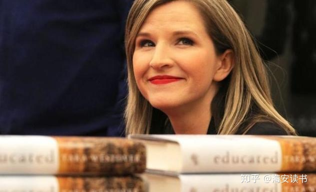

# 你当像鸟飞往你的山 (Flee as a bird to your mountain)

    这是一个关于教育的故事


> 封面: 一支铅笔形状的光束照进了女孩的世界, 她静静的站在血色的山巅, 眺望那些飞往远方的飞鸟.

> 译名: 你当像鸟飞往你的山（Flee as a bird to your mountain）. 出自《圣经·诗篇》, 这句话本身有双重解释, 一种是“逃离”, 一种是“找到新的信仰”.

## after reading

    这是一个关于教育的故事, 我想以塔拉(Tara)的视角去看每个人物.

    我出生在爱达华州的偏僻山区, 一个保守的摩门教家庭

    有一天奶奶突兀地建议:"你想不想去上大学?"
    多年后我才察觉这是我生命中的第一次曙光.
    奶奶甚至掐准了父亲外出的时机, 为我制定逃跑计划.
    可惜此时我不懂什么是大学, 
    我担心的 只有家里牲口有没有喂好 和 父亲事后绝对会暴跳如雷 
    相信奶奶是受过教育的, 至少她了解教育的意义, 并为我埋下了一枚种子
    
    而爷爷年轻时是个脾气火爆的人, 一点就着, 在一次太阳穴受伤后, 开始变得沉默寡言.
    爷爷教会了我如何驯服野马, 
    善良的他目光越过那些即将被赶上绞肉机的体弱受惊的马, 指着其中一匹说: 别装上它, 我们将驯服它.
    我还听说爷爷曾阻止过肖恩对艾琳的施暴.

    提到他们只是因为我不懂, 
    为何 我的父亲既不像 奶奶般远见卓识? 也不像爷爷富有同情心?
    我的童年并不缺乏教育, 父亲成为了唯一的教师, 他教育了我
 
        公立学校是政府洗脑孩子远离上帝的阴谋
        上帝会治愈你, 你的伤痛是上帝的试炼
        医生不是想救你, 他们是想害死你
        女人的位置在家里, 在厨房里
        孩子也是工人, 需要高强度的体力劳作才配住在家里
        你不需要洗手, 你只需要不要尿到手上

    车祸, 压迫, 家暴, 烧伤, 跌落, 洗脑, 发狂, 偏执, 厌女, 极端, 愚昧, 专制...
    我噙着泪记下父亲一件件周而复始的罪证,
    每当我下沉时, 记忆就会出现空洞, 
    家人的记忆常常与我不同, 仿佛只有将我的记忆换成他们的记忆, 就可以拥有家人.

    让我割裂的原因还有爸爸的两面性
    说他愚昧吧, 他却知道车子撞到电线杆后, 身体与车体金属触碰, 避免触电的方法
    他不顾我的安危，一次次将我推向咆哮着的几乎要将人脑袋咬下来的轧钢剪刀, 却也高呼着"耶和华必预备", 他脱下衬衫, 孤身留下与森林火焰战斗. 
    我厌恶爸爸总摆出一幅恨不得把我赶出家门的样子, 却在离别时对我说: "无论你在哪个角落, 世界末日来临时我可以去接你, 带你回家, 让你平平安安的. 但要是你去了大洋彼岸..."
    他一心想着囤积粮食弹药应对所谓的"世界末日", 他却也为了家人的保暖安全, 终日劳苦, 苦苦支撑.
    在我初入学校, 与同学格格不入, 考试通不过, 奖学金也望尘莫及的至暗时刻, 爸爸没有给我酝酿的一击让我滚回家, 而是平静地对我说: "会没事儿的, 宝贝, 钱的问题我会解决, 开心点儿好吗?"
    ...

    这种分裂, 正如他的一个孩子, 我的兄弟 ---- 肖恩
    那个把我从地上扛起并把头塞进马桶, 逼我承认自己是个妓女!
    同时也在我的童年给了我最多温柔, 保护折翼的天使
    我看不透他暴力又富有同情心的背后, 到底是个什么生物

    "你是我的孩子, 我本该好好保护你", 妈妈本应是我的第二道光,
    她曾是个了不起的助产士, 
    积极, 自强, 有趣, 进步
    直到爸爸炮制了上帝的恩泽 ---- 深夜的车祸
    进而在他偏执狂和原教义主义的瓜分下,
    妈妈得到了"上帝的救赎", 丢掉了"自己的救赎"

    事实上, 泰勒和理查德充当了我的第二道光
    他们喜欢学校, 他对学校的爱似乎超过了对家人. ---- 这仅仅是我童年的理解, 而非现在
    我困惑于理查德为何在黑暗中看书, 
    也不认得泰勒的CD上"肖邦"和"莫扎特"是谁,
    多年后我才理解这些对我的影响,
    他们离开时付出的代价, 以及他们是如何发出光亮穿透黑暗的不确定性
    教育就是一棵树摇动另一棵树, 一朵云推动另一朵云, 一个灵魂召唤另一个灵魂 (by 雅斯贝尔斯)

    第三道光, 是我的同学, 老师, 男朋友 和 我的大学生活
    噢说实话, 融入这里真的很难, 我用了一个学期才习惯便后洗手, 进而改善了同学关系
    在与教授对赌成绩时, 我说"好, 虽然机会渺茫, 但我是擅长抓住机会的女王"
    我可以感受到周围人善意与爱, 世界之广大, 
    学期结束时, 我很难想象再回到山上, 回到爸爸身边是什么样子

        (以下几行为塔拉接受访谈时原话)
        对我而言, 困难的不是教育本身, 这本书也并非教你如何考上哈弗剑桥
        教育意味着获得不同的视角, 理解不同的人, 经历和历史. 
        接受教育, 但不要让你的教育僵化成傲慢. 
        教育应当是思想的拓展, 同理心的深化, 视野的开阔. 
        教育不应该使你的偏见变得更顽固. 
        如果人们受过教育, 他们应该变得不那么确定, 而不是更确定. 
        他们应该多听少说, 对差异满怀激情, 热爱那些不同于他们的想法. 

    如今我并不憎恨父亲
    我坚信他是患有双向情感障碍的病人

    我也不憎恨哥哥肖恩
    大火吞噬了他仅有的善良

    母亲是曾背叛我的信任
    她是加害者同样也是受害人, 我怜悯她

    其他的亲属需要依附家族的利益, 
    趋利避害, 我能理解他们

    最终, 我戒掉了对原生家庭的斯德哥尔摩,
    我没有责任治愈我的施虐者, 但我有责任治愈我自己

    就像本书的封面, 
    一支铅笔形状的光束照进了女孩的世界, 
    她静静的站在血色的山巅, 
    眺望那些飞往远方的飞鸟.

    教育给了我选择的能力和权利,
    我当像鸟, 飞往我的山.

---



## notes

```bash
# `想到过错在我, 我感到很欣慰, 因为这意味着事情还在我掌控之下.`

(花了很长时间回书里找这句话...) 
之前以为自责是因为足够在意,
在意->自责, 不在意->不自责, 导致强关联
仿佛 自责=优化调整 了, 事情会向好
从未往前一步想想(其实是不愿承认)
可能游戏的手柄 并不在自己手上
```

```bash
# `“他提醒她这是上帝的旨意，这会保佑我们的家人。”

我常常在惊悚片里看到过激的偏执行为
人遇到未知的恐惧后, 被吓破了胆短暂的进入歇斯底里, 高度敏感不信任, 诱发人性恶意.

无知催化了遇到未知的可能性, 
所以 当一个人足够无知, 遇到未知会成为常态, 就产生偏激

因此 用教育垒砌其防御力, 用爱化解其恐惧感, 可能是一剂良方?
```

```bash
# `风就是风. 人能受得了地面上的阵阵狂风, 所以也能禁得住高空的风. 它们没有区别. 不同的是头脑中怎么想. 我只是站着, 你却都降低身体, 试图弥补, 因为高处让你害怕. 但蹲着走和侧身走并不自然, 这样反而让自己变得脆弱. 如果能控制住恐慌, 这风就不值一提了.`

他强由他强, 清风拂山岗. 他横由他横, 明月照大江.

论保持自己的形状的重要性~
```